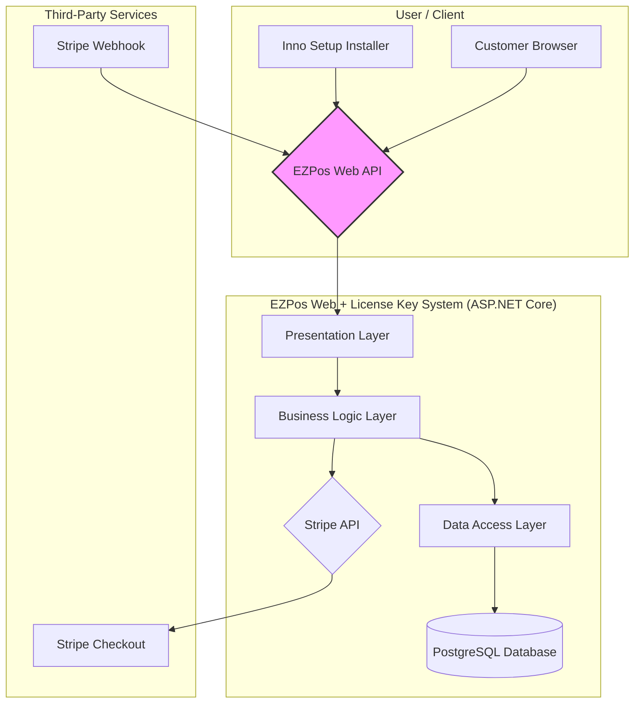

# Architecture

This document provides a high-level overview of the system architecture for the EZPos Web + License Key System.

## Architecture Diagram (Mermaid)

## Data Flow

1.  **Purchase Flow:**
    *   A customer visits the landing page and clicks a "Buy Now" button.
    *   The browser is redirected to a Stripe Checkout session.
    *   After a successful payment, Stripe redirects the customer to a success page.
    *   Stripe sends a `checkout.session.completed` webhook to our API.

2.  **License Generation Flow:**
    *   The webhook endpoint in the **Presentation Layer** receives the Stripe event.
    *   The **Business Logic Layer** validates the event and generates a new license key.
    *   The **Data Access Layer** saves the new license key to the PostgreSQL database.

3.  **License Validation Flow (Inno Setup):**
    *   The EZPos desktop installer (Inno Setup) makes an API call during installation.
    *   It sends the user-provided license key to a validation endpoint.
    *   The **Business Logic Layer** checks the key's validity against the database via the **Data Access Layer**.
    *   The API returns a `valid` or `invalid` response.

## Design Decisions

*   **Minimal APIs vs. Controllers:** We will start with Minimal APIs for simplicity and performance, especially for the public-facing endpoints. Controllers may be used for more complex, internal management features if needed.
*   **Layered Architecture:** A strict layered architecture is enforced to promote separation of concerns, testability, and maintainability. This mirrors the structure of the existing EZPos desktop application.
*   **Code-First Database:** Entity Framework Core with a Code-First approach allows us to define our database schema from our C# models, making it easy to evolve the database as the application grows.
*   **Stripe for Payments:** Stripe is a trusted, developer-friendly payment provider that handles the complexity of PCI compliance. Using Stripe Checkout outsources the payment form, simplifying our implementation.
