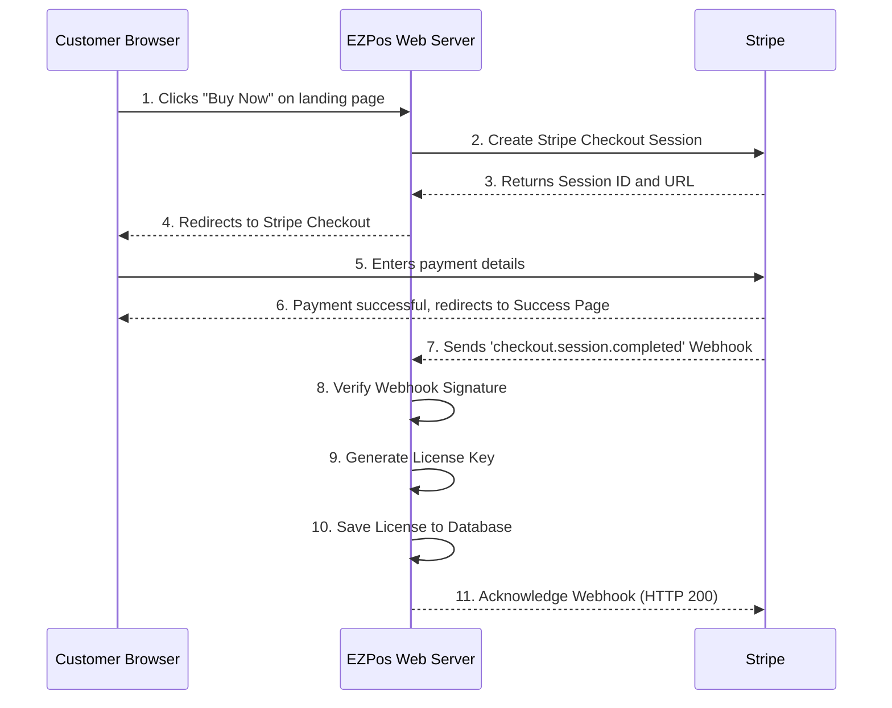

# Payment Flow

This document describes the one-time payment and license generation flow using Stripe.

## Flow Diagram (Mermaid)

## Step-by-Step Explanation

1.  **Initiate Purchase:** The customer clicks a "Buy Now" link on our website. This link will point to an endpoint on our server, e.g., `/purchase`.

2.  **Create Checkout Session:** Our ASP.NET Core backend receives the request. It communicates with the Stripe API to create a `Checkout Session`. This session includes details like the price, product name, and success/cancel URLs.

3.  **Get Session URL:** Stripe's API responds with a unique `Session ID` and a `url` for the hosted checkout page.

4.  **Redirect to Stripe:** The server redirects the customer's browser to the Stripe Checkout URL.

5.  **Customer Pays:** The customer is now on a secure, Stripe-hosted page. They enter their payment information and complete the purchase. Stripe handles all PCI compliance requirements.

6.  **Redirect to Success Page:** Upon successful payment, Stripe redirects the customer back to the `success_url` we specified when creating the session (e.g., `https://ezpos.com/purchase-success`). This page will inform the customer that their license key has been sent to their email.

7.  **Stripe Webhook:** *Asynchronously*, Stripe sends a webhook event of type `checkout.session.completed` to our designated webhook endpoint (`/api/webhooks/stripe`). This is the reliable trigger for our backend to fulfill the order.

8.  **Verify Webhook:** Our webhook handler first verifies the cryptographic signature of the incoming request. This is a critical security step to ensure the request is from Stripe and not a malicious actor.

9.  **Generate License Key:** Once the webhook is validated, we extract the customer's email and other relevant data from the event payload. Our business logic then generates a unique, secure license key.

10. **Save License:** The new license key, along with the customer's email and purchase date, is saved to our PostgreSQL database.

11. **Acknowledge Webhook:** The server responds to Stripe with an `HTTP 200 OK` status to confirm that the event was received and processed successfully. If Stripe does not receive a 200 OK, it will retry sending the webhook multiple times.
