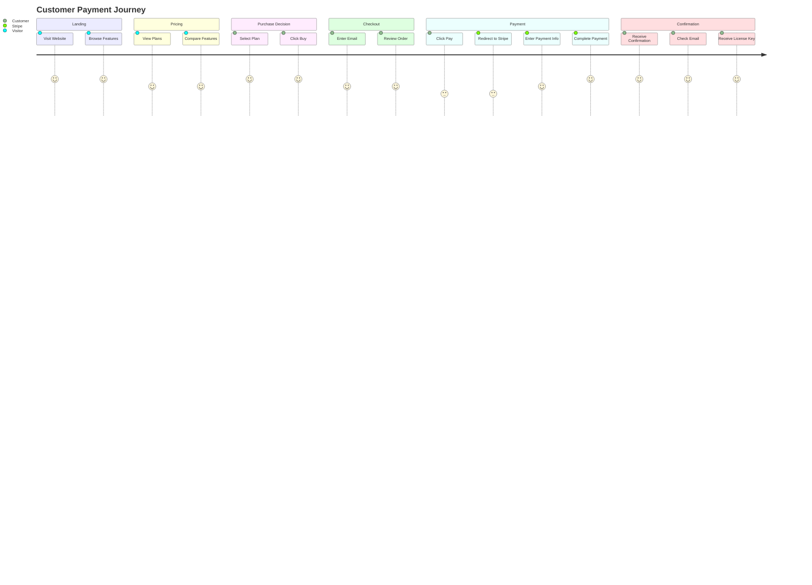

# Payment UI Flow

This document details the step-by-step customer journey from landing page to successful payment and license delivery.

## Customer Journey Map (Mermaid)

## Detailed Step-by-Step Flow

### Phase 1: Discovery & Awareness

**Step 1: User Visits Landing Page**
- User enters the website domain (e.g., `license.ezpos.com`)
- Landing page loads with hero section, features, and pricing overview
- User action: Scroll through features, read benefits

**Step 2: View Features & Testimonials**
- User reads through feature cards and use cases
- User sees social proof (testimonials or usage numbers)
- Emotional state: Building confidence and interest

**Step 3: Navigate to Pricing Page**
- User clicks "View Plans" or "Get Started" button
- Navigates to `/pricing` page
- Pricing page renders with available plans

---

### Phase 2: Pricing & Plan Selection

**Step 4: Review Pricing Tiers**
- User sees pricing card(s) with features and pricing details
- Current implementation: One-time purchase plan
- Future: Multiple tiers (Basic, Pro, Enterprise)
- User reads features and benefits

**Step 5: Select Plan**
- User reviews the plan that best fits their needs
- User clicks "Buy Now" button on the selected pricing card
- Application navigates to `/checkout`

---

### Phase 3: Checkout Form

**Step 6: Enter Customer Information**
- Checkout page loads with order summary on the left
- User sees:
  - Selected plan name and price
  - License type (if configurable)
  - One-time vs. recurring (for future use)
- User enters email address in the form
- Form validates email format in real-time

**Step 7: Confirm Order Summary**
- Right-side form displays:
  - Plan name and price
  - License type
  - Total amount to be charged
- User reviews all details

**Step 8: Accept Terms**
- User checks "I agree to the Terms of Service and Privacy Policy"
- Link to T&Cs available for review
- Button state: "Proceed to Payment" becomes active

**Step 9: Click Payment Button**
- User clicks "Proceed to Payment" or "Continue to Payment"
- Frontend submits checkout form data to backend
- Backend code-behind (CheckoutModel) validates input

---

### Phase 4: Payment Processing

**Step 10: Backend Creates Stripe Session**
- Backend calls `StripeService.CreateCheckoutSessionAsync()`
- Stripe API is called with:
  - Customer email
  - Product name and price
  - Success URL: `/success`
  - Cancel URL: `/pricing` (or `/checkout`)
- Stripe responds with a unique session ID and checkout URL

**Step 11: Redirect to Stripe Checkout**
- Frontend receives Stripe session URL from backend
- JavaScript redirects user to Stripe's hosted checkout page
- User is now on a secure Stripe domain

**Step 12: User Enters Payment Information**
- User is on Stripe's secure checkout page
- User enters:
  - Credit/debit card details
  - Billing address
  - Cardholder name
- Stripe handles all payment processing securely (PCI compliance)

**Step 13: Stripe Processes Payment**
- Stripe validates card information
- Payment gateway processes the transaction
- Stripe updates transaction status

---

### Phase 5: Post-Payment - Success

**Step 14: Payment Confirmation**
- If payment successful:
  - Stripe sends webhook event: `checkout.session.completed`
  - Backend webhook handler receives and validates event
  - Backend generates unique license key
  - License record saved to PostgreSQL database
  - License key stored for email delivery

**Step 15: Stripe Redirects to Success Page**
- User is redirected to success page URL (from session setup)
- Browser navigates to `/success`
- Success page loads with:
  - Green checkmark icon
  - "Payment Successful!" message
  - Confirmation email address
  - Next steps instructions

**Step 16: License Key Delivery (Backend)**
- Meanwhile (asynchronously), backend sends email to customer
- Email contains:
  - License key (unique, generated code)
  - How to activate in EZPos installer
  - Download link for desktop application
  - Support contact info

**Step 17: User Checks Email**
- User receives email from noreply@ezpos.com (or similar)
- Email contains license key and activation instructions
- User copies license key

---

### Phase 5 (Alternative): Payment Failure

**Step 14 (Failed): Payment Declined**
- Stripe detects payment failure (insufficient funds, expired card, etc.)
- User remains on Stripe checkout (error displayed)
- User can retry with different card or cancel

**Step 15 (Failed): User Cancels**
- User clicks "Back" or "Cancel" on Stripe checkout
- Stripe redirects user to cancel URL (e.g., `/pricing`)
- User returns to pricing page
- Session expires (no license created)

---

## UI State Management

### Checkout Page States

| State | Trigger | UI Display | Button State |
|-------|---------|-----------|--------------|
| **Initial** | Page load | Empty form | Disabled (waiting for input) |
| **Validating** | User types | Real-time validation feedback | Disabled if invalid |
| **Valid** | All fields valid | Green checkmarks | Enabled (clickable) |
| **Loading** | User clicks "Pay" | Spinner/loading animation | Disabled (processing) |
| **Error** | API/network error | Error message displayed | Re-enabled (retry) |
| **Redirecting** | Stripe session created | Redirect to Stripe | Disabled (redirecting) |

### Success Page States

| Element | Display | Interaction |
|---------|---------|-------------|
| **Checkmark Icon** | Animated entrance | Celebrates success |
| **Email Display** | Shows confirmation address | User verifies correct email |
| **Next Steps** | Numbered list | Guides user to next action |
| **Buttons** | "Download EZPos" + "Back Home" | Primary and secondary CTAs |
| **Email Status** | "Email sent 2 minutes ago" | Shows email was delivered |

---

## Error Handling & Recovery

### Checkout Form Errors

**Missing Email:**
- Error: "Please enter a valid email address"
- User action: Correct and resubmit

**Payment Failed:**
- User remains on Stripe checkout
- Error message: "Your card was declined. Please try another payment method."
- User action: Retry with different card or contact support

**Network Error (Timeout):**
- Error: "Unable to process payment. Please try again."
- User action: Retry or contact support

### Success Page Issues

**Email Not Received (Future Feature):**
- Button: "Resend License Key to Email"
- Clicking resends email with license key
- Confirmation: "Email sent successfully"

---

## Security Flow

1. **HTTPS Only:** All pages use secure HTTPS connection
2. **Stripe Integration:** Only Stripe's official JavaScript library loaded
3. **CSRF Protection:** ASP.NET Core provides automatic CSRF token validation
4. **Input Validation:** Email and form data validated on client and server
5. **API Authentication:** Backend API endpoints secured with API key or JWT
6. **Webhook Verification:** Stripe webhook signature verified before processing
