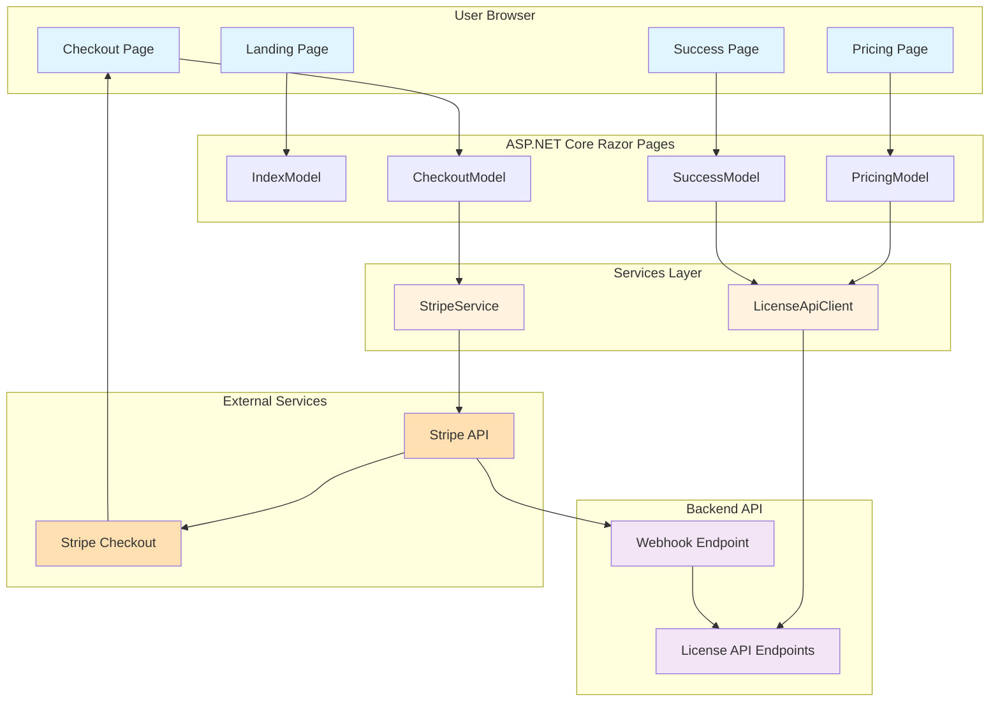

# UI Architecture

This document describes how the UI layer integrates with the License API backend, payment processing, and the overall system architecture.

## UI Architecture Diagram (Mermaid)



## Data Flow

### 1. Landing Page to Pricing Page

```
User visits ezpos-license.com
    ↓
Landing Page loads (Index.cshtml)
    ↓
IndexModel retrieves feature/product info (could be static or from API)
    ↓
User clicks "View Plans" → navigates to /pricing
```

### 2. Pricing Page

```
Pricing page loads (Pricing.cshtml)
    ↓
PricingModel calls LicenseApiClient.GetPricingAsync()
    ↓
Service returns pricing tiers (currently just one-time purchase)
    ↓
Page renders PricingCard components for each tier
    ↓
User clicks "Buy Now" → navigates to /checkout
```

### 3. Checkout to Payment

```
Checkout page loads (Checkout.cshtml)
    ↓
User enters email and selects license type
    ↓
CheckoutModel calls StripeService.CreateCheckoutSessionAsync()
    ↓
StripeService makes API call to Stripe
    ↓
Stripe responds with session URL
    ↓
JavaScript redirects user to Stripe Checkout
    ↓
User completes payment on Stripe's secure page
```

### 4. Post-Payment

```
Stripe processes payment
    ↓
Stripe sends webhook event (checkout.session.completed) to backend API
    ↓
API webhook endpoint validates event and generates license key
    ↓
Stripe redirects user to Success page (/success)
    ↓
SuccessModel displays confirmation and directs user to check email
    ↓
License key is sent to customer's email (via backend)
```

## Component Interaction

### LicenseApiClient

**Purpose:** Communicates with the License API endpoints.

**Methods:**
- `GetPricingAsync()` - Retrieves available pricing tiers.
- `ValidateLicenseAsync(licenseKey)` - Validates a license key.
- `GetLicenseDetailsAsync(licenseKey)` - Retrieves license details.

**Configuration:**
- Injected via dependency injection.
- API base URL stored in `appsettings.json`.

### StripeService

**Purpose:** Handles all Stripe-related operations on the frontend.

**Methods:**
- `CreateCheckoutSessionAsync(email, licenseType)` - Creates a Stripe Checkout session.
- `HandleWebhookAsync(json, signature)` - Verifies and processes webhook events (server-side).

**Configuration:**
- Stripe API key and webhook secret stored in `appsettings.json`.
- Stripe JavaScript library loaded in the checkout page.

## Security Considerations

1. **API Communication:** All API calls use HTTPS. Sensitive data (API keys) never exposed to the browser.
2. **Stripe Integration:** Stripe API keys (public and secret) are kept on the server. Frontend only receives Stripe session IDs.
3. **CORS:** If the UI is served from a different domain than the API, CORS must be configured appropriately.
4. **Session Security:** Checkout sessions include validation to ensure data integrity.
5. **CSP (Content Security Policy):** Headers configured to restrict external scripts (only allow Stripe's official script).

## Responsive Design

- **Bootstrap 5** provides a mobile-first, responsive grid system.
- All pages are designed to work on:
  - Mobile (320px+)
  - Tablet (768px+)
  - Desktop (1024px+)
- CSS utility classes and custom CSS ensure consistency and a professional appearance.
